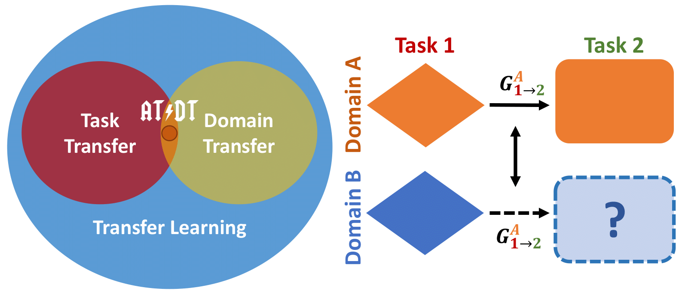

# __: Across Tasks and Domains Transfer

<p align="center">
  
</p> 
                            
This repository contains the source code of AT/DT, proposed in the paper "Learning Across Tasks and Domains", ICCV 2019.
If you use this code in your projects, please cite our paper:

```
@inproceedings{ramirez2019,
  title     = {Learning Across and Domains},
  author    = {Zama Ramirez, Pierluigi and
                Tonioni, Alessio and
                Salti, Samuele and
                Di Stefano, Luigi},
  booktitle = {International Conference on Computer Vision (ICCV)},
  year = {2019}
}
```

## Abstract
Recent works have proven that many relevant visual tasks are closely related one to another.
Yet, this connection is seldom deployed in practice due to the lack of practical methodologies to transfer learned concepts across different training processes. In this work, we introduce a novel adaptation framework that can operate across both task and domains. Our framework learns to transfer knowledge across tasks in a fully supervised domain (e.g. synthetic data) and use this knowledge on a different domain where we have only partial supervision (e.g. real data). Our proposal is complementary to existing domain adaptation techniques and extends them to cross tasks scenarios providing additional performance gains. We prove the effectiveness of our framework across two challenging tasks (i.e. monocular depth estimation and semantic segmentation) and four different domains (Synthia, Carla, Kitti, and Cityscapes).  

For more details:
[arXiv](https://arxiv.org/abs/1904.04744)

## Requirements

* Python 3
* `Tensorflow 1.12 or higher` (recomended)
* `python packages` such as opencv, matplotlib

### Testing system:
* NVIDIA-GTX 1080Ti
* CUDA 9.0 
* CUDNN 7.14

## Download pretrain models

Coming soon.

## Training AT/DT

### Step 1-2: Training Task Networks

1: train a network on Domain A+B and Task 1 

``` 
python3 train_task.py \
      --data_path $path_dataset_mixed \
      --input_list $path_mixed_list 
      --checkpoint_dir $path_checkpoint_task_source \
      --steps 150000 \
      --batch_size 8 \
      --task $source_task \
      --normalizer_fn batch_norm \
      --crop \
      --crop_w 512 \
      --crop_h 512 \
```

2: train a network on Domain A and Task 2

``` 
python3 train_task.py \
      --data_path $path_dataset_source \
      --input_list $path_source_list 
      --checkpoint_dir $path_checkpoint_task_source \
      --steps 25000 \
      --batch_size 8 \
      --task $target_task \
      --normalizer_fn batch_norm \
      --crop \
      --crop_w 512 \
      --crop_h 512 \
```

### Step 3: Training Task Transfer Network (_TrNet_)

3: Train TrNet on A (From Task 1 to Task 2)

``` 
python3 train_transfer.py 
      --data_path $path_dataset_source 
      --input_list $path_source_list 
      --checkpoint_dir $path_checkpoint_transfer 
      --steps 100000 
      --batch_size 1 
      --lr 0.00001 
      --target_task $target_task 
      --normalizer_fn batch_norm 
      --random_crop 
      --crop_w 512 
      --crop_h 512 
      --checkpoint_encoder_source $path_checkpoint_task_source
      --checkpoint_encoder_target $path_checkpoint_task_target
      --checkpoint_decoder        $path_checkpoint_task_target
```

## Inference AT/DT

```
python3 test_transfer.py 
        --data_path $path_target_dataset 
        --input_list $path_target_validation_list 
        --checkpoint_dir $path_checkpoint_transfer --checkpoint_encoder_source $path_checkpoint_task_source --checkpoint_decoder $path_checkpoint_task_target 
        --test_dir $test_dir_transfer 
        --normalizer_fn batch_norm 
        --model dilated-resnet  
        --save_predictions 
        --target_task $target_task
```

## Evaluation

```
python3 ../eval_task.py 
        --dataset_target $dataset_target 
        --data_path $path_target_dataset 
        --input_list $path_target_validation_list 
        --task $target_task 
        --pred_folder $test_dir_transfer/predictions 
        --output $path_results_transfer 
        --convert_to carla 
        --convert_gt
```

where 

`path_dataset_source` and `path_dataset_mixed` and `path_target_dataset`: directory containing the dataset A and A+B dataset

`path_source_list` and `path_mixed_list` and `path_target_validation_list`: txt file where each row contains the relative path to [left_image_path];[semantic_labels];[depth_labels]. Examples of input lists are on *filelist/* folder.

`path_checkpoint_task_target` : path to checkpoint of the network trained on Task 1 and Domain A+B (e.g. Cityscapes and Carla on depth estimation)

`path_checkpoint_transfer` : path to checkpoint of the network trained on Task 2 and Domain 1 (e.g. Carla on semantic segmentation)

`path_checkpoint_transfer` : path to checkpoint of the Transfer Network (TrNet)

`dataset_target` : name of the target dataset (e.g. cityscapes)
